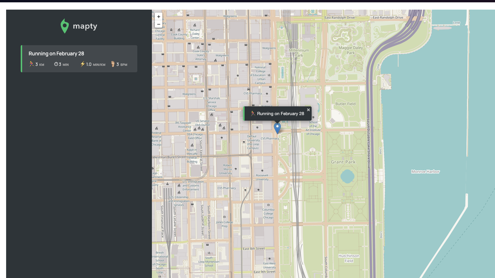

# Geolocation_Workout_App

In order to run this app succesfully and fast, your gonna need some prerequites software. Specifically Node.js, npm (node package manager) and to make things really really really easy - live-server extension on VSCode.

Once you have all thess installed, clone this repository to your local computer, open up the startHere file, open up a terminal and run the following command

`live-server`

this should open up the html file in a chrome tab. Now you can just hit Command+Save to automatically reload the page after youve made a change in the code. 

If you are a user this should just open up the app and you can begin playing around with it :)

Rememeber to allow your browser to access your location. Afterwords if should display your location. Click on anywhere in the map, input a number in the prompt you see, clariy if you completed a 'running' or cycling workout, hit enter and voilaaa.

Since I'm based in Chicago, you should see something like this in your browser.

